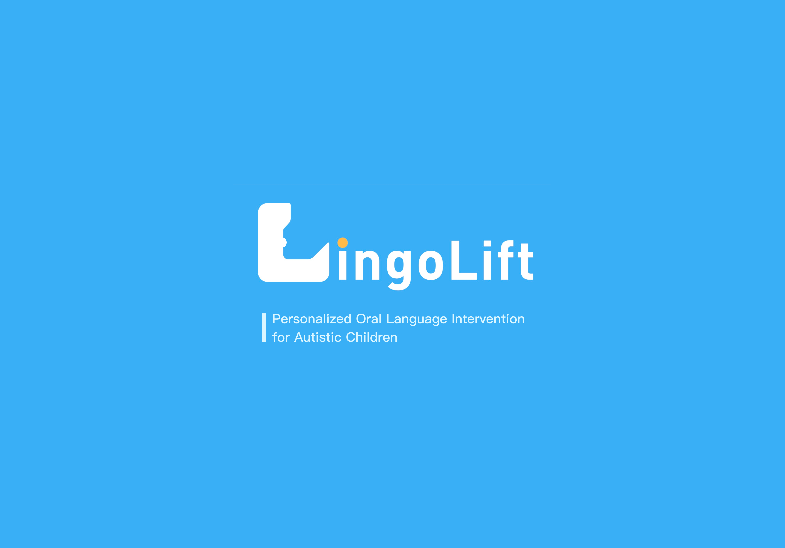

# LingoLift



## Introduction

LingoLift is an educational system developed by [ARK Lab](https://arkxlab.github.io/index.html) from the Hong Kong University of Science and Technology (Guangzhou), specifically designed for personalized training and teaching for children with autism. Leveraging Large Language Models (LLM), Text-to-Image generation, and Augmented Reality (AR) technologies, LingoLift comprises two main subsystems:

- **Teacher Interface:** Enables educators to create individualized lesson plans and teaching materials.
- **Projection Interface:** Utilizes AR for interactive physical operations and classroom instruction.

## Deployment

Make sure you have installed dependencies and React Native CLI globally:

```bash
# install dependencies
yarn install

# for iOS
cd ios && pod install && cd ..

# run on Android
yarn android

# run on iOS
yarn ios
